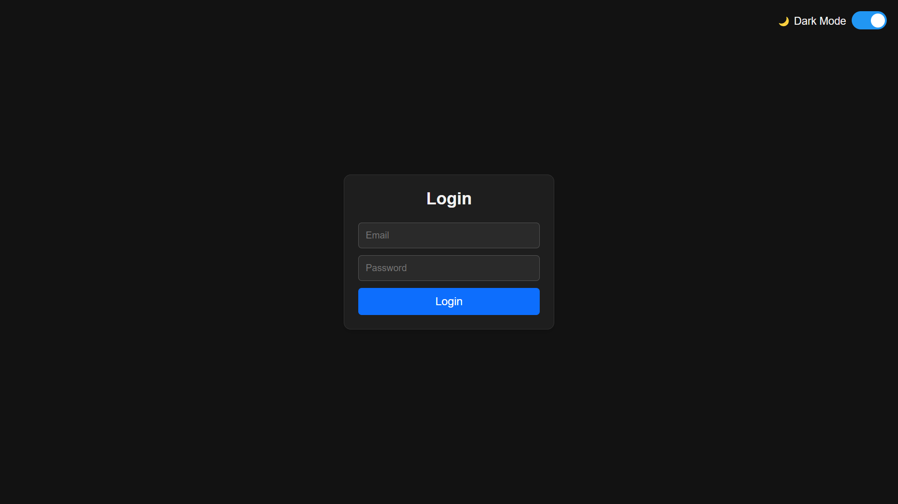
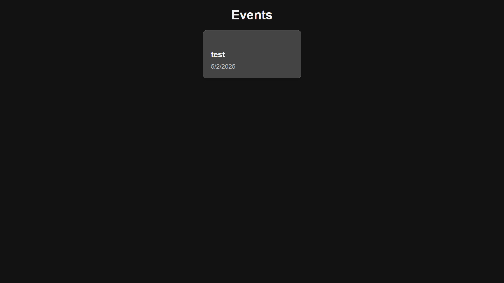

# 🚀 Expense Tracker - CSE Association

An advanced **Expense Tracker** for the **CSE Association** to manage event expenses efficiently. This system allows office bearers to **add expenses, track remaining balances**, and enables the **admin** to monitor and manage budgets with ease.

## 🌟 Features
- **Admin & User Authentication** ✅
- **Event-Based Expense Tracking** 📊
- **Category-Wise Budget Management** 💰
- **User Expense Input with Item & Amount** 📝
- **Admin Privileges:**
  - Create, Edit & Delete Events ⚙️
  - Set & Update Category Budgets 🎯
  - View Total & User-Wise Expenses 🔍
- **Mobile Responsive UI** 📱
- **Animations for Smooth UX** ✨
- **MongoDB Cloud Storage** ☁️
- **Secure Login & OTP-Based Registration** 🔐

---

## 🎯 Tech Stack
### **Frontend**
- React.js (Vite)
- React Router
- Tailwind CSS / Custom CSS

### **Backend**
- Node.js
- Express.js
- MongoDB Atlas (Mongoose)
- Nodemailer (For OTP Verification)

---

## ⚡ Setup Guide
### **1️⃣ Clone the Repository**
```sh
 git clone https://github.com/Gurukprs/expense-tracker.git
 cd expense-tracker
```

### **2️⃣ Backend Setup**
```sh
 cd server
 npm install
```

🔹 **Environment Variables (`.env`)**
```
MONGO_URI=your-mongodb-connection-string
JWT_SECRET=your-secret-key
EMAIL_USER=your-email@gmail.com
EMAIL_PASS=your-app-password
ADMIN_EMAIL=admin@kongu.edu
```

```sh
 npm start
```
_Server runs on **PORT 5000**_

---

### **3️⃣ Frontend Setup**
```sh
 cd client
 npm install
 npm run dev
```
_Frontend runs on **PORT 3000**_

---

## 🚀 How to Use
### **🔹 User Registration (with OTP Verification)**
1. Enter **@kongu.edu** email & receive OTP.
2. Verify OTP to complete registration.
3. Log in & start adding expenses under events.

### **🔹 Admin Privileges**
1. Log in with **admin@kongu.edu**.
2. **Create an Event** & set budget categories.
3. View **real-time expense tracking** & remaining budget.

### **🔹 Expense Management**
- Users can **input expenses** under a selected **criterion**.
- Admin can **edit budgets** & **delete expenses**.
- Both Admin & Users can view **total expenses per category**.

---

## 📸 Screenshots
| Login Page | Dashboard |
|------------|----------|
|  |  |

---

## 📌 API Endpoints
### **🔹 Auth Routes**
| Method | Route | Description |
|--------|-------|-------------|
| POST | `/auth/register` | Send OTP to email |
| POST | `/auth/verify-otp` | Verify OTP & Register User |
| POST | `/auth/login` | User/Admin Login |

### **🔹 Event Routes**
| Method | Route | Description |
|--------|-------|-------------|
| POST | `/event/create` | Create a new event (Admin) |
| GET | `/event/:id` | Get event details |
| POST | `/event/:id/expense` | Add expense under an event |
| PUT | `/event/:id/update` | Edit event details (Admin) |
| DELETE | `/event/:id/delete` | Delete an event (Admin) |

---

## 🛠️ Troubleshooting
**Common Issues & Fixes**:
- **MongoDB Connection Failed?** → Check `MONGO_URI` in `.env`
- **Email OTP Not Sent?** → Use Google **App Password** instead of your Gmail password.
- **CORS Error?** → Add `cors()` middleware in `server.js`

---

## 📜 License
This project is **open-source**. Feel free to contribute!

---

## 🙌 Contributors
🔹 **Guruprasaath S**

---

## ⭐ Show Your Support!
If you find this project useful, **give it a star ⭐** & contribute! 💡

Happy Coding! 🚀

